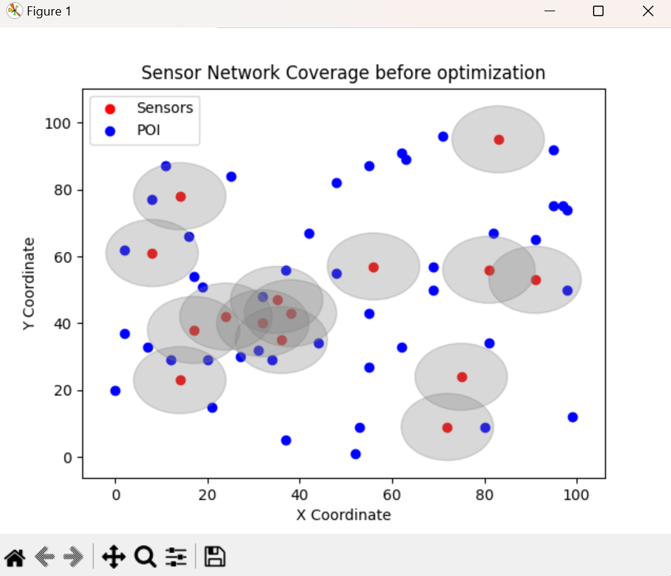
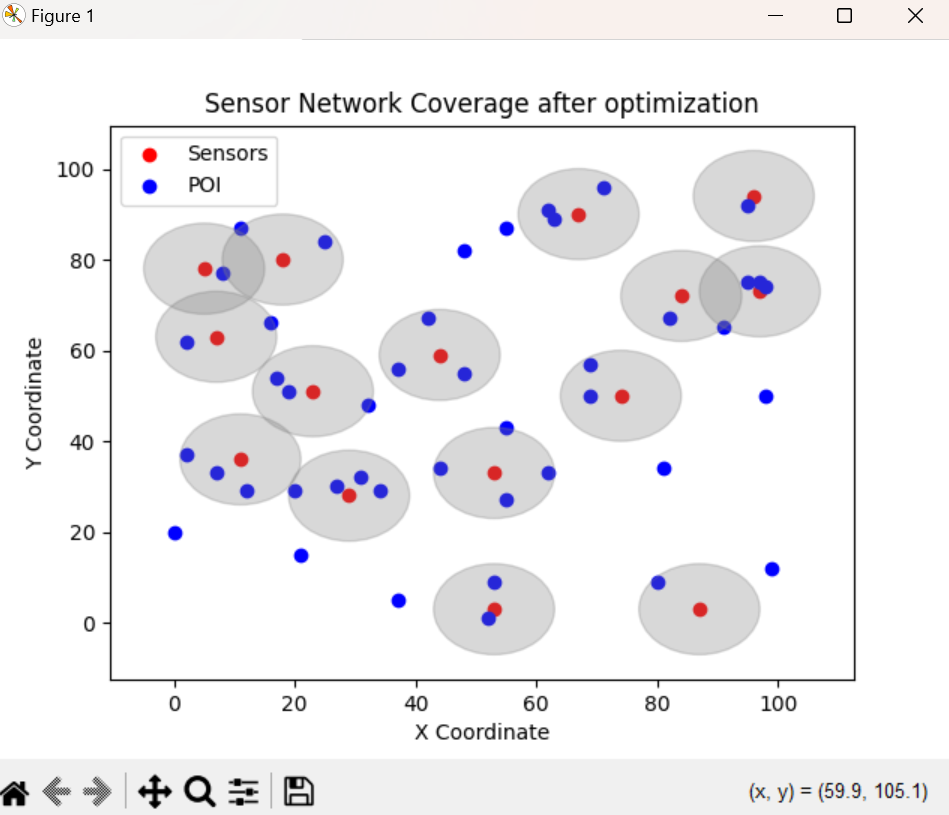
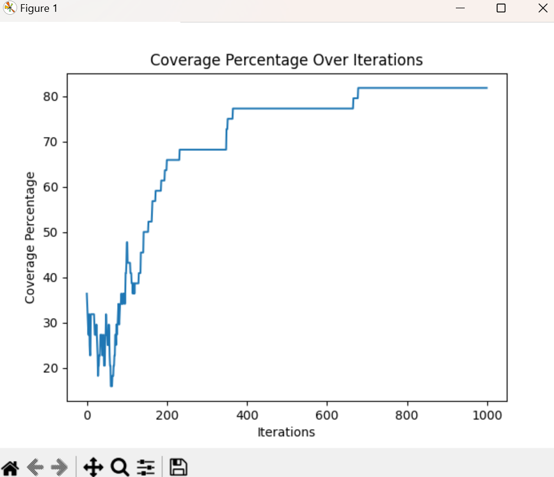
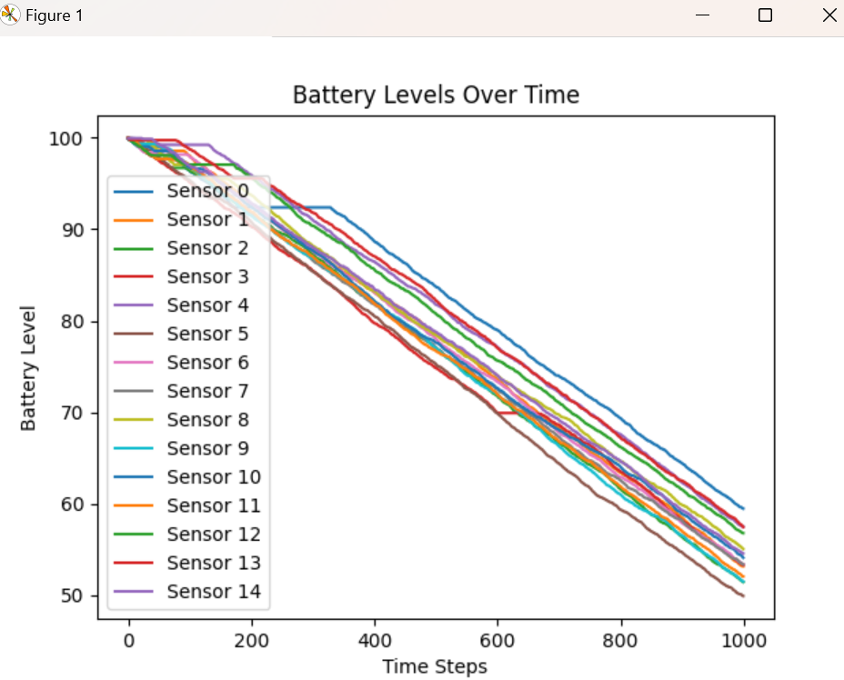
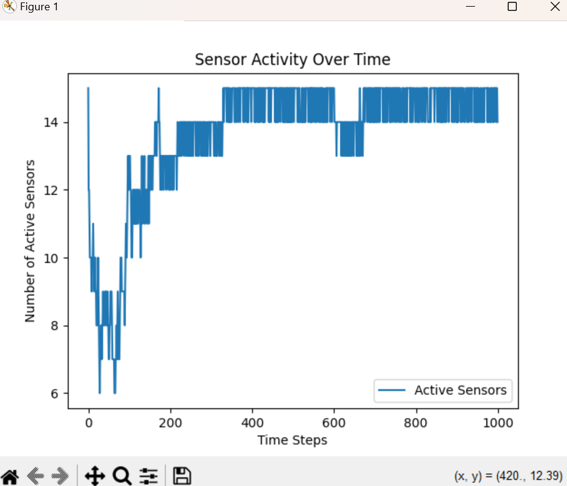

# Sensor Network Lifetime Optimization using Simulated Annealing

## Project Overview

This project simulates the problem of maximizing the lifetime of a sensor network using a simulated annealing algorithm. It includes a graphical user interface (GUI) for user interaction and visualization of the optimization process.

## Table of Contents

- [Project Overview](#project-overview)
- [System Architecture](#system-architecture)
- [Simulated Annealing Algorithm](#simulated-annealing-algorithm)
- [Installation](#installation)
- [Usage](#usage)
- [Technical Documentation](#technical-documentation)
- [User Documentation](#user-documentation)
- [Testing](#testing)
- [Examples](#examples)

## System Architecture

### Input
- **Sensor positions:** Initial positions of sensors.
- **Sensor number**: Number of sensors on the area.
- **Energy levels:** Initial energy levels of sensors.
- **Communication range:** Range within which sensors can communicate.
- **POI number:** Number of POIs to detect.

### Output
- **Optimized sensor network configuration:** Configuration that maximizes the network's coverage.
- **Statistical analysis both visual and descriptive in the terminal**

### Modules
1. **Simulated Annealing Optimization**
2. **Sensor Network Simulation**

## Simulated Annealing Algorithm

### Steps
1. **Initialization:** Start with an initial solution (random sensor configuration).
2. **Iteration:** 
   - Generate a neighboring solution.
   - Evaluate the new solution.
   - Decide whether to move to the new solution based on the acceptance probability.
3. **Cooling Schedule:** Gradually reduce the temperature.
4. **Termination:** Stop after a fixed number of iterations or when the system has sufficiently cooled.

## Installation

### Prerequisites
- Python 3.x
- Tkinter (usually included with Python)

## Usage
1. **Run the GUI application:**
    - python project.py
2. **Configure simulation** with file or manually
3. **In the GUI, click the "Start Optimization" button to begin the simulated annealing process.**

## Technical Documentation

### Overview

This system is designed to optimize the configuration of a sensor network to maximize its lifetime using a simulated annealing algorithm.

### System Design
- **Simulated Annealing Optimization:** Handles the core optimization logic.
- **Sensor Network Simulation:** Models the sensor network and its properties.

### Code Structure
- SimulatedAnnealing class
- SensorNetwork class
- main function

## User Documentation

### Installation Instructions
Follow the steps in the Installation section to set up the project.

### Usage Guide
1. **Run the GUI application using python project.py**
2. **Configure simulation** with file or manually
3. **Click the "Start Optimization" button to start the optimization process.**
4. **View the results in the message box that appears after the optimization is complete.**

## Testing
- Unit Tests

## Example of usage
- **Initial Configuration:** Configured in test.json file
- **Optimized Configuration:** Sensors are repositioned to maximize network lifetime.

## Attachments of example usage

